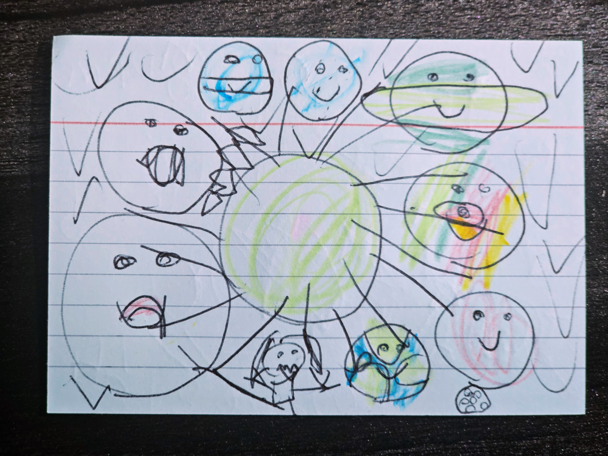

It started like any other afternoon. My daughter burst into the room, beaming, clutching a sheet of paper as if it contained the secrets of the universe.

"Look!" she announced, thrusting the page toward me. "The solar system."

I gave it a quick glance. I saw circles, filled unevenly with random colors. "It's nice, sweetie," I said, patting her head.

"This is for you," she said, eyes bright, then spun away, already on to her next discovery.

"Thank you," I whispered to the empty air.

Later, as the house fell quiet, a stray thought nudged me. I felt an inexplicable urge to look closer. I lifted the paper, held it up to the light, and leaned in.

That's when the world on the page changed.

The circles weren't just planets; they were faces. Most beamed with smiley mouths. Near the edge, a pale circle wore a down-turned mouth—a sad face. Beside it, a tiny stick-figure girl was mid-kick, her foot extended toward the lonely circle.

My heart skipped. I felt like an explorer discovering a lost civilization in my own living room. I had to know more.

I found her in the next room and sat beside her.

"Hey," I said softly, "can you tell me why that little planet looks sad? And why is the girl kicking it?"

She didn't hesitate. The story was already written in her mind.

"That's Pluto," she replied, serious, without a trace of playfulness. "It's sad because Pluto isn't a planet anymore."

I blinked, waiting for a punchline that never came.

"And the girl?" I asked.

"She's an astronomer," she explained, gesturing to the stick figure. "She's kicking Pluto out of the planet group because of the rules."

I sat there, stunned, as the depth of her observation washed over me like a wave. This wasn't just a doodle; it was a compact narrative about loss, scientific reclassification, and the sense of unfairness that adults often impose.

It made me wonder: *What else am I missing?*

How many “drawings” do we glance at each day without truly seeing? How many conversations do we merely scan instead of listening to? How many beautiful, complex, heartbreaking truths sit right in front of us, hidden behind a layer of superficiality?

We rush from task to task, checking boxes, moving through life in a blur of productivity. We “look” at our children, our work, our partners—but we often fail to *see*.

Kids live in a state of constant, profound observation. They don't just see a circle; they see a character. They don't just see a fact; they see a tragedy. They demand that we slow down, that we witness the details.

So the next time someone hands you a piece of their world, don't settle for a quick smile and a "nice one." Lean in. Look closely. You might discover that a simple drawing of the solar system is actually a masterclass in empathy, history, and the bittersweet nature of change.

Don't miss the details. That's where the magic lives.

And here is the picture of the drawing that inspired this reflection:

